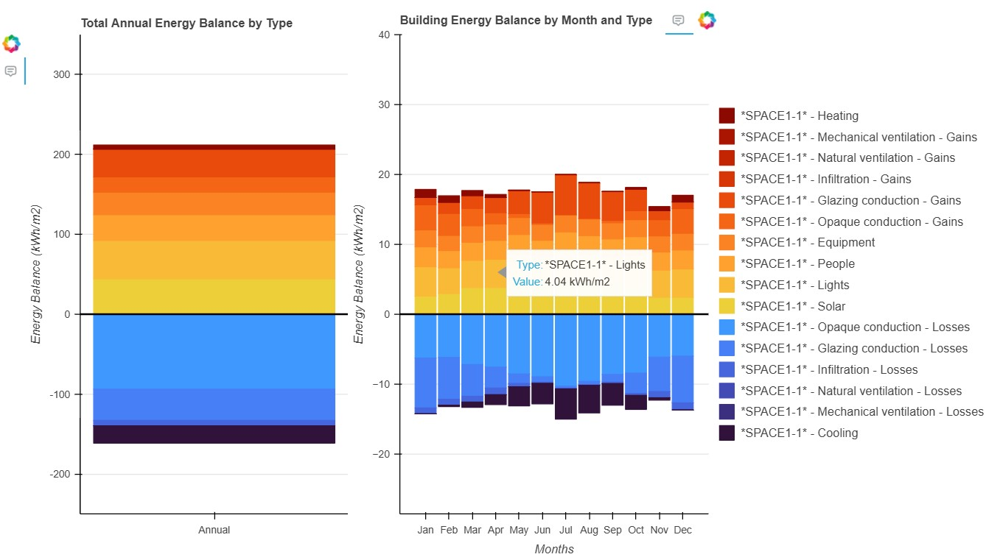
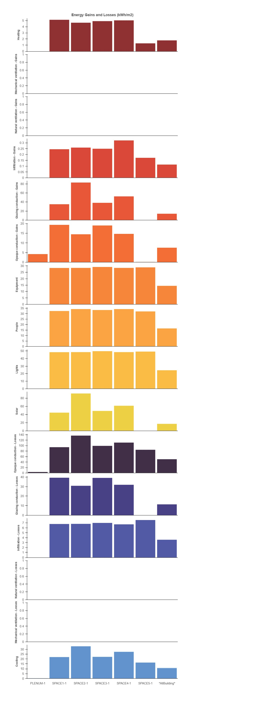

Bar chart - Gains & Lossess
============================

Overview
--------
This visualization displays the monthly **energy balance** of each zone,
including solar gains, internal gains, ventilation losses, envelope losses,
and other thermal components. It supports both stacked bar charts and
comparison bar charts.

Example Figures
----------------

GainsAndLosses Module
~~~~~~~~~~~~~~~~~~~~~

.. automodule:: Visualizations.GainsAndLosses.GainsAndLosses
   :members:
   :undoc-members:
   :show-inheritance:
   :private-members:

Package contents
----------------

.. automodule:: Visualizations.GainsAndLosses
   :members:
   :undoc-members:
   :show-inheritance:
   :private-members:
